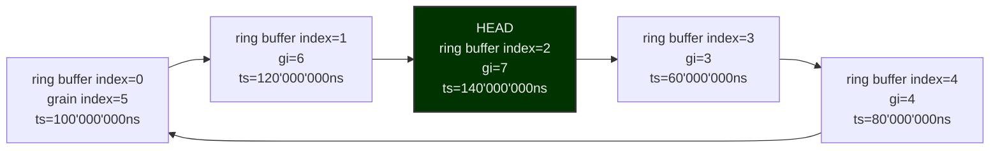

<!-- SPDX-FileCopyrightText: 2025 Contributors to the Media eXchange Layer project. -->
<!-- SPDX-License-Identifier: CC-BY-4.0 -->

# Timing Model

As described in the [architecture](./Architecture.md) page, the grains of an MXL flow are organized in a ring buffer. Each index of the ring buffer correspond to a timestamp relative to the PTP epoch as defined by SMPTE 2059-1. MXL does NOT require a PTP/SMPTE 2059 time source : it only _leverages_ the epoch and clock definitions (TAI time) as defined in SMPTE 2059-1.

A comprehensive definition of the DMF and MXL timing model is being developed by the [JT-DMF End-to-End Synchronisation Working Group][def].

## Requirements

For single host MXL environments, any stable time sources such as NTP or SMPTE ST 2059 is adequate.

For multiple hosts MXL environments, MXL requires that the time source of these hosts does not slip against each other over time (the timing source frequency over time shall be the same). Jitter is acceptable and expected - the time stamping model in MXL will describe it properly.

Any NTP locked source that can be traced back to a Stratum 0 time source (atomic clocks/gps fleet) and SMPTE 2059 PTP time source that is properly locked to GPS will provide this guarantee. All cloud providers provide very accurate time sync services (sub millisecond accuracy).

## Ring buffers

Grains are organized as ring buffers. The grain count is a function of the flow grain_rate and desired history length. For example if a flow grain_rate is 50/1, each grain will be worth 20'000'000 ns (1/50 \* 1'000'000) of data. A ring buffer with 100ms of history will have 5 grains (5 \* 20ms/grain = 100ms). Time starts at the SMPTE 2059-1 epoch and is expressed a nanoseconds since that epoch.

Ring buffer indices encode timing information — **the ring buffer cannot be treated as a simple queue of grains.** A writer media function must carefully compute the grain index at which it writes based on the frequency domain of the incoming grains. If the writer cannot guarantee that the external source shares a common frequency domain with the MXL host, it must implement a re-synchronization strategy (grain drop, grain repeat, dynamic audio resampling, etc.) to maintain alignment with the host's timing.

### Example indexing

The following table demonstrates the indexing logic for a 50/1 fps video flow stored in a ring buffer of 5 grains.

| Grain Index | TAI Timestamp (ns since SMPTE ST 2059 epoch) | Ring buffer Index |
| ----------- | -------------------------------------------- | ----------------- |
| 0           | 0                                            | 0                 |
| 1           | 20'000'000                                   | 1                 |
| 2           | 40'000'000                                   | 2                 |
| 3           | 60'000'000                                   | 3                 |
| 4           | 80'000'000                                   | 4                 |
| 5           | 100'000'000                                  | 0                 |
| 6           | 120'000'000                                  | 1                 |
| 7           | 140'000'000                                  | 2                 |
| 8           | 160'000'000                                  | 3                 |
| 9           | 180'000'000                                  | 4                 |

The following graph demonstrates a ring buffer where the head has wrapped around and is now at ring buffer index 2 (the time span between grain 3 and 7 in the table above).

### Converting a timestamp (ns since SMPTE ST 2059 epoch) to a grain index

This conversion is a simple division:

$$
GrainDurationNs = GrainRateDenominator * 1'000'000'000 / GrainRateNumerator
$$

$$
GrainIndex = Timestamp / GrainDurationNs
$$

### Converting a grain index to a ring buffer index

The conversion is the remainder of the integer division of the grain index by the ring buffer length. :

$$
RingBufferIndex = GrainIndex \bmod RingBufferLength
$$

## Origin timestamps (OTS)

MXL does not try to hide or compensate for jitter and latency automatically: it relies instead on the origin timestamps of the media grains for accurate indexing. If origin timestamps are not available explicitly through RTP header extensions they can be inferred at capture time by 'unrolling' the RTP timestamps of 2110 and AES67 packets or through other transport-specific mechanisms.

In absence of origin timestamps a receiver media function may need to re-timestamp incoming media and write at $grainIndex(T{now})$.

MXL Flow replication between hosts will preserve the indexing of the grains. In other words, the flow IDs, grain indexes and ring buffer size and indexes.

### Example Flow Writer behaviors

- A 2110-20 receiver media function can unroll the RTP timestamp of the first RTP packet of the frame and use it to compute the grain index write to. This index may be slightly in the past.
- A media function that generates grains locally (CG, Test Pattern Generator, etc) can simply use the current TAI time as a timestamp and convert it to a grain index.
- A well behaved writer media function should try to 'pace itself' according to the MXL host clock.  It should write to the ring buffer at a mostly constant rate and avoid writing chunks of media representing large amounts of time (i.e. multiple frames for video, multiple seconds of audio, etc)."
- A well behaved writer media function will not create flows whose latency drift over time. An implementer can monitor a flow latency using the 'mxl-info' tool part of the SDK.  The flow latency should be low and mostly constant (minimal variation) over a long period of time (hours).

### Example Flow Readers behaviors

A media function consuming one or many flows may use multiple alignment strategies.

- If inter-flow alignment is not required it can simply consume the flows at their respective 'head' position.
- If alignment is required then a reading strategy could be to start reading at the lower grain index :

$$
ReadIndex = min(F1_{head} ... FN_{head})
$$

## Time functions

All time helpers operate on nanoseconds and rational time bases. Continuous flows typically pass the sample rate (`grainRate`) directly to these
helpers when scheduling wake-ups or calculating how far to advance `headIndex`. Refer to `mxl/time.h` for the canonical API surface.

[def]: https://www.amwa.tv/jtdmf
